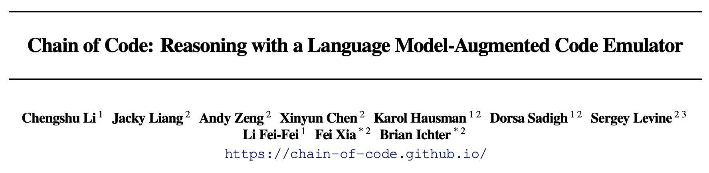
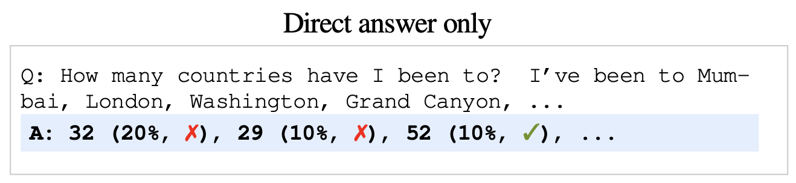
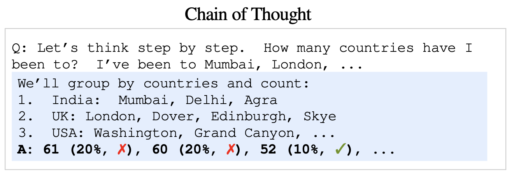
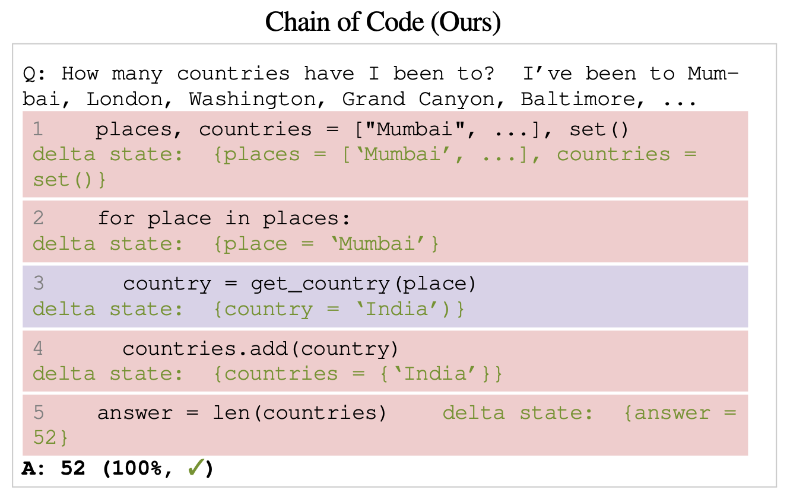
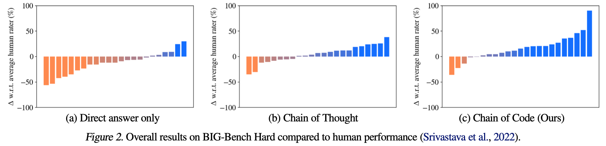
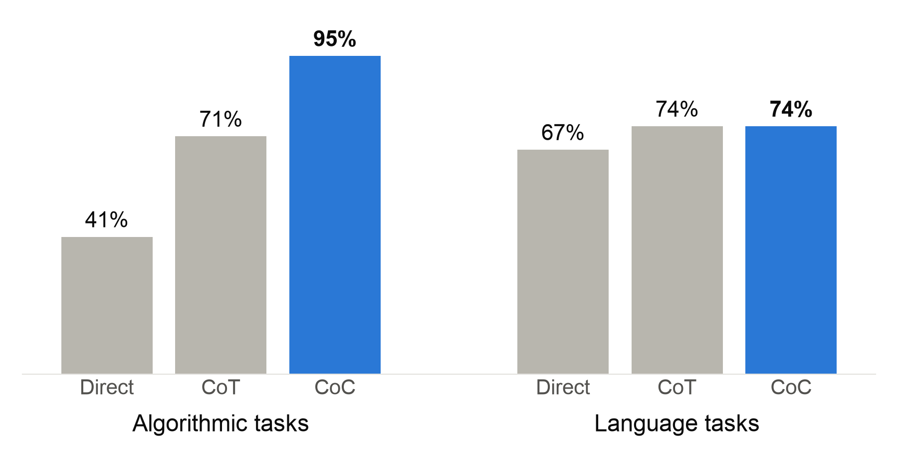
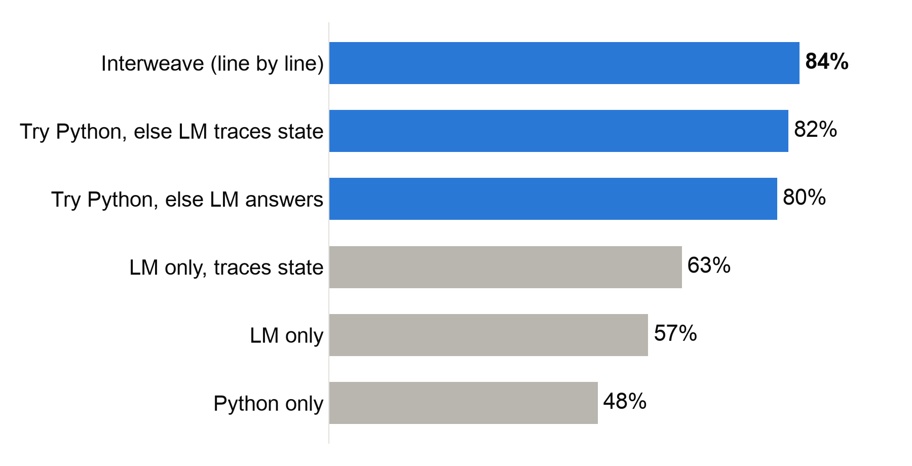
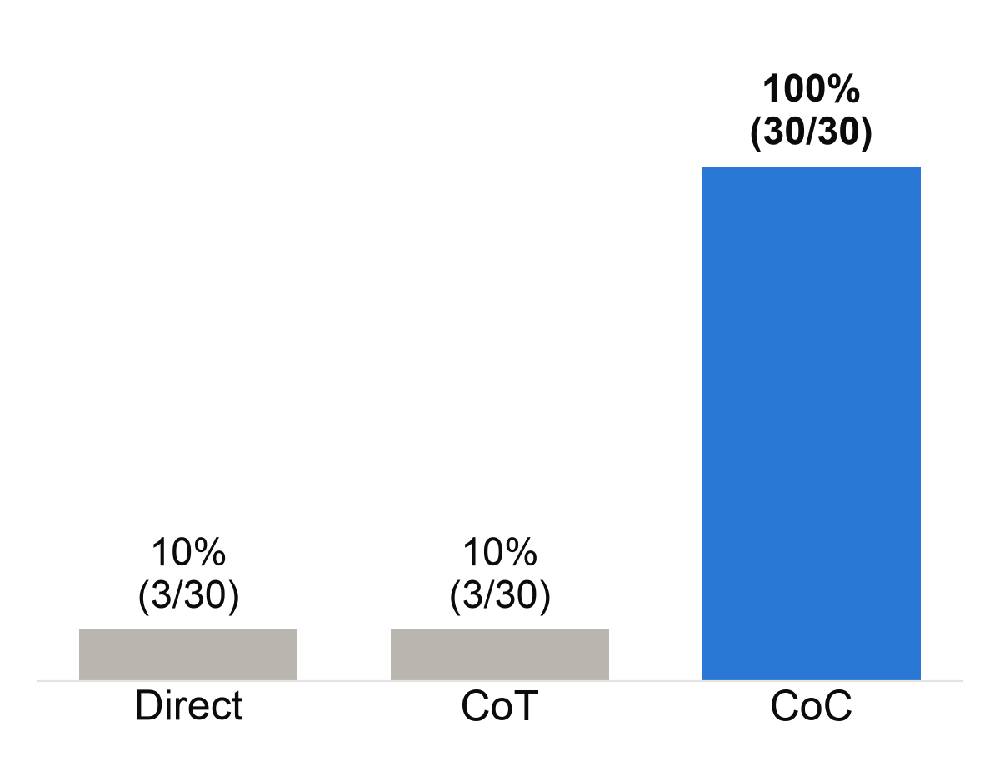
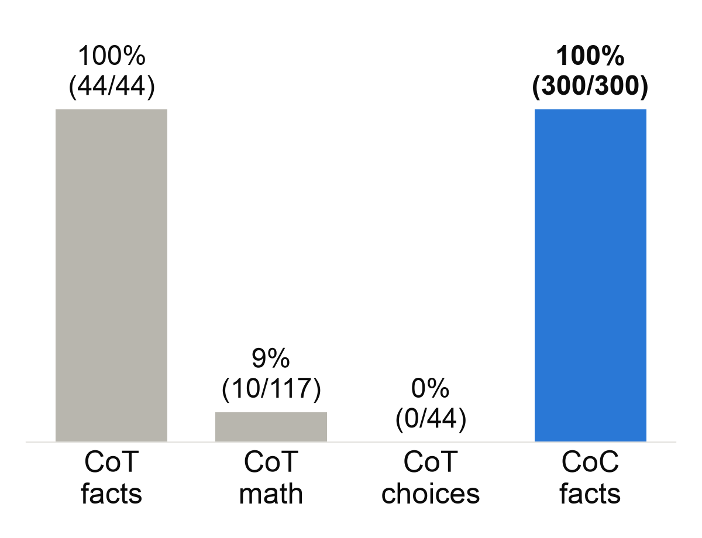

## {.center}

::: {style="text-align: center;"}
[^1^Stanford University · ^2^Google DeepMind · ^3^UC Berkeley]{style="font-size: 70%;"}

International Conference on Machine Learning (ICML) 2024

**Sean Murphy** · October 23, 2026
:::

## The problem

::: {.middle}
::: {.indent}
In 2024, LLMs were great with language, but shaky with simple math.
:::

> Which is bigger: 9.11 or 9.9?

::: {.indent}
GPT-4o, Claude 3.5, Llama 3 (2024): **9.11** [✗]{style="color: red;"}
:::
:::

::: aside
[Jim Fan, X, July 2024](https://x.com/DrJimFan/status/1816521330298356181)
:::

## Example Problem Requiring Both Language and Math {.small-title}

::: {style="font-size: 70%;"}
**How many countries have I been to?**
:::

::: {style="font-size: 50%;"}
I’ve been to Mumbai, London, Washington, Grand Canyon, Baltimore, Longsheng, Guilin, Beijing, Galapagos, Quito, Barcelona, [Paris]{.hl}, Prague, Nice, Dehli, Agra, Rome, Florence, Amalfi, Athens, Míkonos, Málaga, Monaco, Berlin, Munich, Innsbruck, Bern, Milan, Lucerne, Gimmelwald (Schilthornbahn), St Moritz, St Petersburg, Helsinki, Amsterdam, Gdańsk, Vancouver, Anchorage, Montreal, [Belize]{.hl}, The Bahamas, Jamaica, [Hawaii]{.hl}, Acadia National Park, Stockholm, Copenhagen, Dover, Lyon, Madrid, Toulouse, Santorini, Oslo, Kusadasi, Souda, Rhodes, Tallinn, Venice, Naples, Cape Town, Johannesburg, Addis Abeba, Nairobi, Seattle, San Francisco, Chicago, St Louis, Memphis, Chinle, Stanford, New York, Philadelphia, Boston, Miami, New Orleans, [Walt Disney World Resort]{.hl}, Jacksonville, Las Vegas, Los Angeles, Portland, Salt Lake City, Tahoe City, Phoenix, Albuquerque, Cleveland, Charlottesville, Nags Head, [Newfoundland and Labrador]{.hl}, Burlington, Wilmington, Myrtle Beach, St Lucia, Barbados, Banff, Haiti, Montego Bay, Sao Palo, Rio, Lima, Cusco, Cozumel, Amarillo, [Yosemite National Park]{.hl}, Joshua Tree, Zion National Park, Bryce Canyon National Park, Grand Teton National Park, Yellowstone National Park, Glacier National Park, Mount Hood, Paso Robles, San Diego, Bend, North Cascades National Park, Olympic National Park Visitor Center, Jasper National Park, Sequoia National Park, Kings Canyon National Park, Shasta National Forest, [Mount Saint Helens]{.hl}, Mount Rainier, Austin, Buenos Aires, El Calafate, El Chaltén, Fitz Roy, Torres del Paine National Park, Puerto Natales, Puerto Varas, Santiago, Marble Caves, Cerro Castillo, Coyhaique, Singapore, Casablanca, Marrakesh, Cairo, Jerusalem, Tokyo, Kyoto Prefecture, Taipei City, Taichung City, Krk, Naturpark Puez-Geisler, Ljubljana, Plitvice Lakes National Park, Fairbanks, Juneau, Dallas, Sydney, Cairns, Brisbane, [Hook Island]{.hl}, Charleston, Panama City, Bangkok, Chiang Mai, Bengaluru, Denver, Indianapolis, Nashville, Blacksburg, Lisbon, Porto, Estes Park, Coeur d’Alene, Hood River, Denali, Sitka, Mexico City, Warsaw, Geneva, Auckland, Queenstown, Whitefish, Minneapolis, Sioux Falls, Bozeman, Missoula, Springfield, Skye, Edinburgh, Honolulu, Kauai, Haleakalā National Park, Wrangell-St. Elias National Park & Preserve, Atlanta, Tirana, Corfu, Siena.
:::

::: aside
[Figure A5 from Li et al., ICML 2024](https://arxiv.org/abs/2312.04474)
:::

## Three Prompts to Answer "How Many Countries" {.small-title}

:::: {.columns}
::: {.column width="50%"}

::: {.small-text}
[Direct Answer]{.method-header}

- Model answers immediately, no reasoning
- Right only 10%
:::

::: {.small-text}
[Chain-of-Thought]{.method-header}

- Model reasons step-by-step in words
- Still right only 10%
:::
:::

::: {.column width="50%"}

::: {.small-text}
[Chain-of-Code]{.method-header}

- Prompt includes pseudo-code examples
- Model writes code to solve it
- Harness runs code in Python or LM
- Lines in red evaluated with Python
- Lines in purple evaluated with an LLM
- **Right 100% of the time**
:::
:::
::::

::: aside
[Figure 1 from Li et al., ICML 2024](https://arxiv.org/abs/2312.04474)
:::

## Chain-of-Code Outperforms Direct-Answer and Chain-of-Thought {.smaller-title}

::: {.small-text}
BIG-Bench Hard: 23 tasks that are hard for LLMs. Examples:

:::: {.columns}
::: {.column width="50%"}
- **Arithmetic:** ((−3 + 5 × 8 × −4) − (9 − 8 × −7)) = ?
- **Brackets:** close the sequence ( [ { } ]
- **Dates:** what date was 10 days before Christmas Eve 1937?
- **Logic:** not (True and False) or False = ?
:::

::: {.column width="50%"}
- **Word order:** "terrible rubber ship" or "rubber terrible ship"?
- **Sports:** is "the quarterback hit a home run" plausible?
- **Sarcasm:** which of two sentences is sarcastic?
:::
::::
:::

::: aside
[Figure 2 from Li et al., ICML 2024](https://arxiv.org/abs/2312.04474)
:::

## Chain-of-Code Helps Most on Algorithmic Tasks {.small-title}

{width="72%" fig-align="center"}

::: {style="display: table; margin: -1.2em auto 0; font-size: 80%;"}
- Average accuracy on BIG-Bench Hard.
- On language tasks, CoC still matches CoT.
:::

::: aside
[Data from Figure 4 and Table A1, Li et al., ICML 2024](https://arxiv.org/abs/2312.04474)
:::

## Both Python and the LM Are Needed {.small-title}

{width="95%" fig-align="center"}

::: {style="display: table; margin: -2em auto 0; font-size: 80%;"}
- Average accuracy on BIG-Bench Hard.
- [Blue]{style="color: #2a78d6;"}: uses both Python and the LM.
:::

::: aside
[Data from Table 2, Li et al., ICML 2024](https://arxiv.org/abs/2312.04474)
:::

## How does it actually work? Birthday Demo {.small-title}

::: {style="font-size: 60%;"}
> Of the birthdays of Banting, Curie, Darwin, Einstein, Gauss, Hawking, Lovelace, Rutherford, Tesla, and Turing that are at least 100 days before or after **15 March 2027**, whose is closest?

Qwen2.5-Coder 7B (base model) on a laptop · three worked examples per method
:::

:::: {.columns}
::: {.column .chart-column width="50%"}
**Correct answers, 30 random dates**

{width="92%"}
:::

::: {.column .chart-column width="50%"}
**Steps correct: facts vs. math**

{width="92%"}
:::
::::

## Summary and Conclusion

::: {.middle style="font-size: 85%;"}
- LLMs know facts, but are shaky at exact math
- Chain of Code: the LM writes code; Python runs what it can, the LM emulates the rest
- Paper: 84% on BIG-Bench Hard, vs. 72% for Chain of Thought
- Our demo (7B model): 30/30 vs. 3/30, with the same facts, but Python doing the math
- Limit: works best when the examples come from the same kind of problem
:::

::: aside
[Paper results: Table 1 from Li et al., ICML 2024](https://arxiv.org/abs/2312.04474)
:::

## References

::: {.references style="font-size: 60%;"}
Li, C., Liang, J., Zeng, A., Chen, X., Hausman, K., Sadigh, D., Levine, S., Fei-Fei, L., Xia, F., & Ichter, B. (2024).
*Chain of Code: Reasoning with a Language Model-Augmented Code Emulator.*
Proceedings of the 41st International Conference on Machine Learning (ICML), PMLR 235.

- Paper: <https://arxiv.org/abs/2312.04474>
- Project page: <https://chain-of-code.github.io/>

Suzgun, M., Scales, N., Schärli, N., Gehrmann, S., et al. (2022).
*Challenging BIG-Bench Tasks and Whether Chain-of-Thought Can Solve Them.*
arXiv:2210.09261. <https://arxiv.org/abs/2210.09261>

Hui, B., Yang, J., Cui, Z., Yang, J., et al. (2024).
*Qwen2.5-Coder Technical Report.* arXiv:2409.12186. <https://arxiv.org/abs/2409.12186>\
Demo model: qwen2.5-coder:7b-base via Ollama, <https://ollama.com/library/qwen2.5-coder>

Fan, J. (2024, July 25). Post on X about frontier models failing "9.11 vs 9.9". <https://x.com/DrJimFan/status/1816521330298356181>
:::
